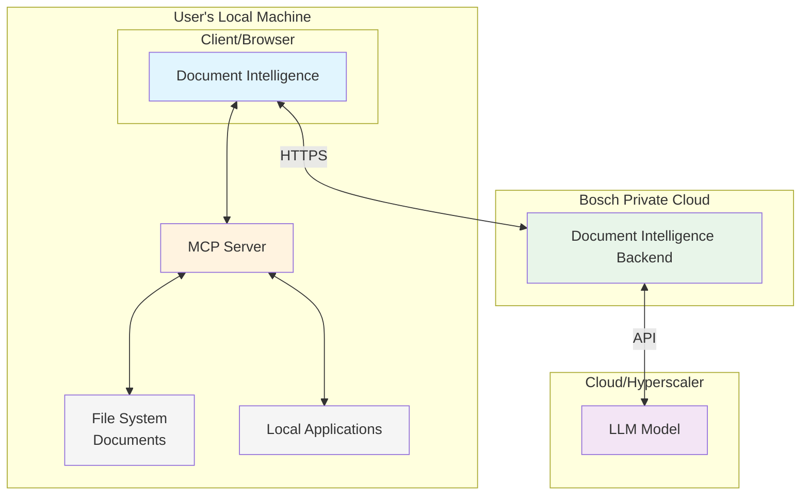

# di-mcpserver
Model Context Protocol (MCP) server implementation using FastMCP v2 with HTTP transport for use with Document Intelligence

## Architecture

## Implementation Guide
While MCP server are exptected to implement the standard streaming-http interface (SSE has been deprected from the MCP standard) browser security requires a relaxed CORS policy. Please see the demo server for a reference implementation.

