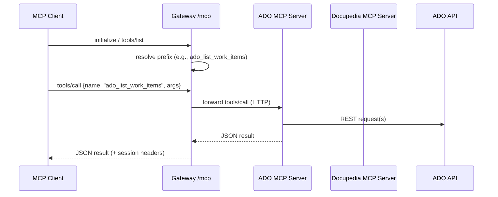
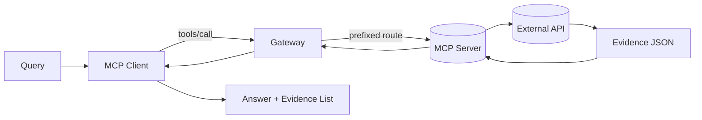

# MCP Connector – Architektur und Datenfluss

**Executive Summary**
- Drei Laufzeitkomponenten: MCP Gateway (Aggregator) und zwei MCP Server (Azure DevOps, Confluence/Docupedia), alle über HTTP-Transport. Belegt: [mcp-gateway/gateway_server.py](mcp-gateway/gateway_server.py#L562-L569), [mcp-ado/mcp_server.py](mcp-ado/mcp_server.py#L627-L636), [mcp-docupedia/mcp_server.py](mcp-docupedia/mcp_server.py#L678-L689), [mcp-gateway/fastmcp.json](mcp-gateway/fastmcp.json#L15-L21).
- Start via Script und uv: ADO (8003), Docupedia (8004), Gateway UI (8001). Belegt: [start-all.ps1](start-all.ps1#L36-L47), [start-all.ps1](start-all.ps1#L50-L54).
- Gateway mountet Child-Server als HTTP-Proxy (`ProxyClient`) oder als lokale Module, mit Präfix-Namespace. Belegt: [mcp-gateway/gateway_server.py](mcp-gateway/gateway_server.py#L317-L321), [mcp-gateway/gateway_server.py](mcp-gateway/gateway_server.py#L420-L432), [mcp-gateway/gateway_config.json](mcp-gateway/gateway_config.json#L17-L31).
- Jeder Server bietet `/mcp` (MCP) und Health-Endpoints, CORS mit `mcp-session-id` in `expose_headers`. Belegt: [mcp-ado/mcp_server.py](mcp-ado/mcp_server.py#L160-L168), [mcp-ado/mcp_server.py](mcp-ado/mcp_server.py#L627-L636), [mcp-docupedia/mcp_server.py](mcp-docupedia/mcp_server.py#L183-L201), [mcp-docupedia/mcp_server.py](mcp-docupedia/mcp_server.py#L678-L689), [mcp-gateway/gateway_server.py](mcp-gateway/gateway_server.py#L551-L560).
- ADO-Tools: Work Items, Repos, Builds, PRs, Code Search. Docupedia-Tools: Suche, Seiten/Spaces, Kommentare/Labels. Belegt: [mcp-ado/mcp_server.py](mcp-ado/mcp_server.py#L171-L538), [mcp-docupedia/mcp_server.py](mcp-docupedia/mcp_server.py#L197-L574).
- Auth: ADO via PAT (Basic), Confluence via Bearer oder Basic; ENV-Interpolation. Belegt: [mcp-ado/mcp_server.py](mcp-ado/mcp_server.py#L81-L94), [mcp-docupedia/mcp_server.py](mcp-docupedia/mcp_server.py#L86-L121), [mcp-ado/config.json](mcp-ado/config.json#L4-L12), [mcp-docupedia/config.json](mcp-docupedia/config.json#L4-L11).

---

**Repository-Überblick**
- Sprachen/Frameworks
  - Python 3.10+ (Gateway 3.12+), FastMCP, Starlette/Uvicorn, Requests/urllib3, Rich (UI).
    - Belegt: [mcp-ado/pyproject.toml](mcp-ado/pyproject.toml), [mcp-docupedia/pyproject.toml](mcp-docupedia/pyproject.toml), [mcp-gateway/pyproject.toml](mcp-gateway/pyproject.toml#L5-L10).
- Build/Run
  - ADO Server (8003): `uv run mcp_server.py` (ENV `MCP_ADO_PORT`). Belegt: [mcp-ado/README.md](mcp-ado/README.md#L73-L86), [mcp-ado/mcp_server.py](mcp-ado/mcp_server.py#L640-L647).
  - Docupedia Server (8004): `uv run mcp_server.py` (ENV `MCP_CONFLUENCE_PORT`). Belegt: [mcp-docupedia/README.md](mcp-docupedia/README.md#L92-L104), [mcp-docupedia/mcp_server.py](mcp-docupedia/mcp_server.py#L665-L673).
  - Gateway UI (8001): `uv run ui.py`. Belegt: [start-all.ps1](start-all.ps1#L50-L54), [mcp-gateway/README.md](mcp-gateway/README.md#L58-L68).
  - Gateway Headless: `uv run gateway_server.py [port]`. Belegt: [mcp-gateway/README.md](mcp-gateway/README.md#L70-L77), [mcp-gateway/gateway_server.py](mcp-gateway/gateway_server.py#L514-L521).
- Entry Points
  - ADO: `main()` mit `mcp.http_app(path="/mcp")`. Belegt: [mcp-ado/mcp_server.py](mcp-ado/mcp_server.py#L624-L636).
  - Docupedia: analog. Belegt: [mcp-docupedia/mcp_server.py](mcp-docupedia/mcp_server.py#L651-L689).
  - Gateway: Health `/health`, Status `/status`, Metrics `/metrics`, MCP `/mcp`. Belegt: [mcp-gateway/gateway_server.py](mcp-gateway/gateway_server.py#L142-L151), [mcp-gateway/gateway_server.py](mcp-gateway/gateway_server.py#L207-L275), [mcp-gateway/gateway_server.py](mcp-gateway/gateway_server.py#L562-L569).

**Architekturbeschreibung**
- Komponenten & Verantwortlichkeiten
  - MCP Gateway: Aggregation, Proxy/Mount von Child-Servern, Prefix-Namespace, Health/Metriken. Belegt: [mcp-gateway/gateway_server.py](mcp-gateway/gateway_server.py#L46-L75;L85-L136;L317-L321;L432).
  - MCP ADO Server: Azure DevOps REST-Kapselung als Tools/Resources/Prompts. Belegt: [mcp-ado/mcp_server.py](mcp-ado/mcp_server.py#L171-L589).
  - MCP Docupedia Server: Confluence REST-Kapselung als Tools/Resources/Prompts. Belegt: [mcp-docupedia/mcp_server.py](mcp-docupedia/mcp_server.py#L197-L618).
- Schnittstellen
  - HTTP-Transport via FastMCP `/mcp`; keine `stdio`-Transporte im Code. Belegt: [mcp-ado/mcp_server.py](mcp-ado/mcp_server.py#L627-L636), [mcp-docupedia/mcp_server.py](mcp-docupedia/mcp_server.py#L678-L689), [mcp-gateway/fastmcp.json](mcp-gateway/fastmcp.json#L15-L21).
- Datenflüsse (kurz)
  - Client → Gateway (`/mcp`) → Prefix-Dispatch → Zielserver → REST (ADO/Confluence) → JSON-Ergebnis → Gateway → Client.
    - Belegt: [mcp-gateway/gateway_server.py](mcp-gateway/gateway_server.py#L317-L321;L432), [mcp-ado/mcp_server.py](mcp-ado/mcp_server.py#L108-L151), [mcp-docupedia/mcp_server.py](mcp-docupedia/mcp_server.py#L130-L175).

**Datenfluss (User Request → Response)**
- Initialisierung/Sitzung
  - Beispiel-Initialisierung mit `initialize` und `mcp-session-id` Header. Belegt: [mcp-ado/README.md](mcp-ado/README.md#L114-L151), [mcp-docupedia/README.md](mcp-docupedia/README.md#L116-L157), CORS `expose_headers`: [mcp-ado/mcp_server.py](mcp-ado/mcp_server.py#L599-L606), [mcp-docupedia/mcp_server.py](mcp-docupedia/mcp_server.py#L631-L639).
- Toolaufruf
  - Gateway: Auflösung über Präfix, Weiterleitung an Proxy/Modul. Belegt: [mcp-gateway/gateway_server.py](mcp-gateway/gateway_server.py#L317-L321;L432).
- Backend-Aufruf
  - ADO: REST-Requests mit Basic-Auth (PAT) und API-Versionierung. Belegt: [mcp-ado/mcp_server.py](mcp-ado/mcp_server.py#L108-L151;L90-L94).
  - Docupedia: REST-Requests mit Bearer/PAT oder Basic, optional Proxy/SSL-Ausnahme. Belegt: [mcp-docupedia/mcp_server.py](mcp-docupedia/mcp_server.py#L130-L175;L86-L121;L123-L149).
- Rückgabe
  - JSON-Antworten aus Tools; Gateway aktualisiert Metriken. Belegt: [mcp-gateway/gateway_server.py](mcp-gateway/gateway_server.py#L57-L75).

**MCP-spezifisch**
- Transport: HTTP (FastMCP `http_app`), keine `stdio`-Transporte. Belegt: [mcp-ado/mcp_server.py](mcp-ado/mcp_server.py#L627-L636), [mcp-docupedia/mcp_server.py](mcp-docupedia/mcp_server.py#L678-L689), [mcp-gateway/fastmcp.json](mcp-gateway/fastmcp.json#L15-L21).
- ADO Tools (Auszug; Name → Eingaben)
  - `list_work_items(organization?, project?, wiql_query?, max_results?)` [mcp-ado/mcp_server.py](mcp-ado/mcp_server.py#L171-L198)
  - `get_work_item(work_item_id, organization?, project?)` [mcp-ado/mcp_server.py](mcp-ado/mcp_server.py#L233-L265)
  - `create_work_item(type, title, description?, assigned_to?, tags?, organization?, project?)` [mcp-ado/mcp_server.py](mcp-ado/mcp_server.py#L265-L339)
  - `list_repositories(organization?, project?)` [mcp-ado/mcp_server.py](mcp-ado/mcp_server.py#L339-L365)
  - `get_repository_commits(repository_id, max_results?, organization?, project?)` [mcp-ado/mcp_server.py](mcp-ado/mcp_server.py#L365-L399)
  - `list_builds(max_results?, status_filter?, organization?, project?)` [mcp-ado/mcp_server.py](mcp-ado/mcp_server.py#L399-L433)
  - `get_build_details(build_id, organization?, project?)` [mcp-ado/mcp_server.py](mcp-ado/mcp_server.py#L433-L461)
  - `list_pull_requests(repository_id, status?, organization?, project?)` [mcp-ado/mcp_server.py](mcp-ado/mcp_server.py#L461-L495)
  - `search_code(search_text, max_results?, organization?, project?)` [mcp-ado/mcp_server.py](mcp-ado/mcp_server.py#L495-L538)
- ADO Resources/Prompts
  - `ado://config`, `ado://projects/{organization}` [mcp-ado/mcp_server.py](mcp-ado/mcp_server.py#L540-L564)
  - `work_item_analysis(...)`, `pr_review_prompt(...)` [mcp-ado/mcp_server.py](mcp-ado/mcp_server.py#L565-L587)
- Docupedia Tools (Auszug)
  - `search_content(query, space_key?, content_type?, max_results?)` [mcp-docupedia/mcp_server.py](mcp-docupedia/mcp_server.py#L197-L243)
  - `get_page(page_id? | page_title+space_key, expand?)` [mcp-docupedia/mcp_server.py](mcp-docupedia/mcp_server.py#L244-L281)
  - `create_page(space_key, title, content, parent_id?, content_format?)` [mcp-docupedia/mcp_server.py](mcp-docupedia/mcp_server.py#L281-L319)
  - `update_page(page_id, title, content, version_number, content_format?)` [mcp-docupedia/mcp_server.py](mcp-docupedia/mcp_server.py#L319-L354)
  - `list_spaces(max_results?, space_type?)` [mcp-docupedia/mcp_server.py](mcp-docupedia/mcp_server.py#L354-L384)
  - `get_space(space_key, expand?)` [mcp-docupedia/mcp_server.py](mcp-docupedia/mcp_server.py#L384-L402)
  - `list_pages_in_space(space_key, max_results?, expand?)` [mcp-docupedia/mcp_server.py](mcp-docupedia/mcp_server.py#L402-L433)
  - `get_page_children(page_id, expand?)` [mcp-docupedia/mcp_server.py](mcp-docupedia/mcp_server.py#L433-L451)
  - `get_page_attachments(page_id, max_results?)` [mcp-docupedia/mcp_server.py](mcp-docupedia/mcp_server.py#L451-L478)
  - `get_page_comments(page_id, max_results?)` [mcp-docupedia/mcp_server.py](mcp-docupedia/mcp_server.py#L478-L505)
  - `add_comment(page_id, comment_text)` [mcp-docupedia/mcp_server.py](mcp-docupedia/mcp_server.py#L505-L533)
  - `get_page_labels(page_id)` / `add_label(page_id, label_name)` [mcp-docupedia/mcp_server.py](mcp-docupedia/mcp_server.py#L533-L574)
- Docupedia Resources/Prompts
  - `confluence://config`, `confluence://spaces` [mcp-docupedia/mcp_server.py](mcp-docupedia/mcp_server.py#L574-L596)
  - `page_summary_prompt(page_id)`, `documentation_prompt(topic, space_key)` [mcp-docupedia/mcp_server.py](mcp-docupedia/mcp_server.py#L596-L618)

**Auth/RBAC**
- ADO: PAT (Basic) mit ENV-Expansion; Basic-Header via Base64. Belegt: [mcp-ado/mcp_server.py](mcp-ado/mcp_server.py#L81-L94).
- Docupedia: Bearer (PAT) bevorzugt, Fallback Basic (username/password). Belegt: [mcp-docupedia/mcp_server.py](mcp-docupedia/mcp_server.py#L86-L121).
- Proxy/SSL (Docupedia): optionaler Proxy, SSL-Verifikation deaktivierbar (nur intern). Belegt: [mcp-docupedia/mcp_server.py](mcp-docupedia/mcp_server.py#L123-L149).
- Hinweis: Logs zeigen Token-Präfix/Länge (empfohlen: entfernen). Belegt: [mcp-ado/mcp_server.py](mcp-ado/mcp_server.py#L90), [mcp-docupedia/mcp_server.py](mcp-docupedia/mcp_server.py#L93).

---

## Diagramme

### C4 Level 2 (Container)
Legende: Container = Laufzeitkomponenten (Client, Gateway, MCP-Server, externe Systeme); Kanten = HTTP/REST.

```mermaid
flowchart LR
  client[Client (MCP)] -->|HTTP /mcp| gw[MCP Gateway (FastMCP)]
  gw -->|proxy prefix: ado| adoSrv[ADO MCP Server]
  gw -->|proxy prefix: docupedia| docSrv[Docupedia MCP Server]

  adoSrv -->|REST| adoAPI[(Azure DevOps REST API)]
  docSrv -->|REST| confAPI[(Confluence/Docupedia REST API)]

  subgraph Runtime
    gw --- ui[Gateway UI (Rich)]
  end
```

Annahmen/Unsicherheiten:
- Präfix-Strategie aus `gateway_config.json`; Client kann auch direkt mit ADO/Docupedia sprechen. Belegt: [mcp-gateway/gateway_config.json](mcp-gateway/gateway_config.json#L17-L31), [start-all.ps1](start-all.ps1#L62-L66), [mcp-gateway/gateway_server.py](mcp-gateway/gateway_server.py#L562-L569).

### Komponenten (Gateway + Server + Quellen)
Legende: Hauptkomponenten und Kopplung (ProxyClient/Mount, Tools → REST).

```mermaid
flowchart TB
  subgraph Gateway
    GW[FastMCP gateway]
    PC[ProxyClient(url)]
    MOUNT[Mount prefix]
    METRICS[GatewayState metrics]
    GW --> MOUNT
    MOUNT --> PC
    GW --> METRICS
  end

  subgraph ADO Server
    A_MCP[FastMCP("Azure DevOps MCP Server")]
    A_TOOLS[list/get/create WI, repos, builds, PRs, search]
    A_RES[ado://config, ado://projects]
    A_MCP --> A_TOOLS --> ADO_API[(Azure DevOps REST)]
    A_MCP --> A_RES
  end

  subgraph Docupedia Server
    D_MCP[FastMCP("Confluence MCP Server")]
    D_TOOLS[search, pages, spaces, comments, labels]
    D_RES[confluence://config, confluence://spaces]
    D_MCP --> D_TOOLS --> CONF_API[(Confluence REST)]
    D_MCP --> D_RES
  end

  GW --- A_MCP
  GW --- D_MCP
```

Belege: Proxy/Mount [mcp-gateway/gateway_server.py](mcp-gateway/gateway_server.py#L317-L321;L432); Tools/Resources [mcp-ado/mcp_server.py](mcp-ado/mcp_server.py#L171-L574), [mcp-docupedia/mcp_server.py](mcp-docupedia/mcp_server.py#L197-L596).

### Sequenz: "Ask Question → Toolcalling → Evidence Response"
Legende: MCP Client ruft Gateway auf, Gateway routet an passenden Server.



Belege: Endpoints [mcp-gateway/gateway_server.py](mcp-gateway/gateway_server.py#L562-L569), Routing [mcp-gateway/gateway_server.py](mcp-gateway/gateway_server.py#L317-L321;L432), ADO REST [mcp-ado/mcp_server.py](mcp-ado/mcp_server.py#L108-L151).

### Data Flow Diagram (DFD) – "Knowledge Query"
Legende: Datenobjekte Query, Sources, Evidence, Result.



Belege: REST-Pfade [mcp-ado/mcp_server.py](mcp-ado/mcp_server.py#L108-L151), [mcp-docupedia/mcp_server.py](mcp-docupedia/mcp_server.py#L130-L175), Routing [mcp-gateway/gateway_server.py](mcp-gateway/gateway_server.py#L317-L321;L432).

---

## Offene Punkte / Unsicherheiten
- [UNSICHER – MANUELLE PRÜFUNG] SSE vs. Streaming-HTTP: Readmes erwähnen SSE, der Code setzt HTTP (FastMCP) ein; Kompatibilität clientseitig prüfen. Belege: [mcp-ado/README.md](mcp-ado/README.md#L35-L41), [mcp-docupedia/README.md](mcp-docupedia/README.md#L27-L34).
- [UNSICHER – MANUELLE PRÜFUNG] RBAC/Scopes liegen in ADO/Confluence; keine zusätzliche serverseitige RBAC-Schicht identifiziert.
- [UNSICHER – MANUELLE PRÜFUNG] Präfixing von Resources/Prompts erfolgt implizit über Mount; Client-Erwartungen prüfen.
- Sicherheits-Härtung: Token-Präfix nicht loggen; CORS-`*` nur in Dev-Umgebungen.

## Quellen (Beispiele)
- Gateway: [mcp-gateway/gateway_server.py](mcp-gateway/gateway_server.py#L35;L142-L151;L207-L275;L317-L321;L432;L551-L569)
- ADO Server: [mcp-ado/mcp_server.py](mcp-ado/mcp_server.py#L81-L94;L108-L151;L160-L168;L171-L589;L599-L636)
- Docupedia Server: [mcp-docupedia/mcp_server.py](mcp-docupedia/mcp_server.py#L86-L121;L123-L175;L183-L201;L197-L618;L631-L689)
- Configs: [mcp-gateway/gateway_config.json](mcp-gateway/gateway_config.json), [mcp-ado/config.json](mcp-ado/config.json), [mcp-docupedia/config.json](mcp-docupedia/config.json)
